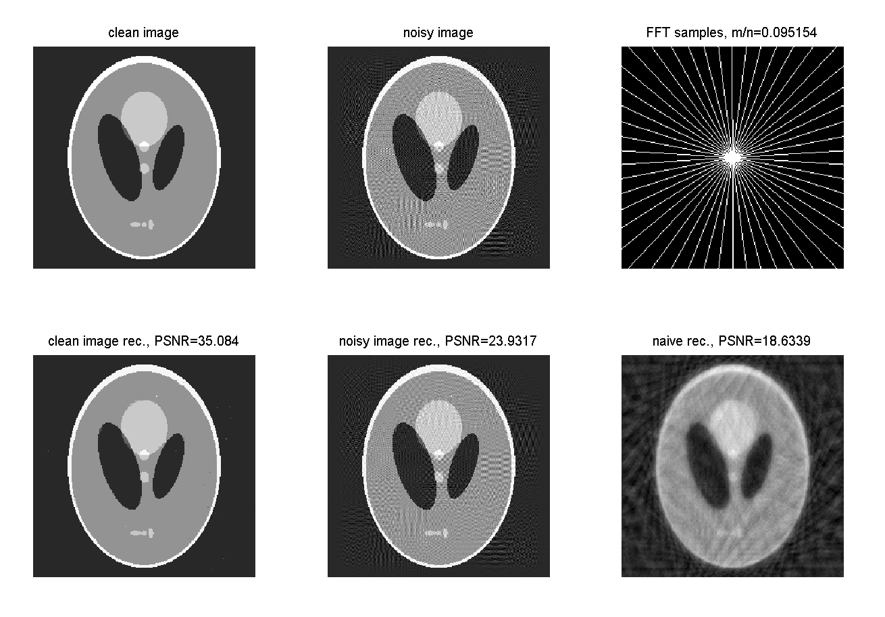

# GCoSaMP
Generalizing CoSaMP to Signals from a Union of Low Dimensional Linear Subspaces

@article{tirer2018generalizing,  
  &nbsp; &nbsp; title={Generalizing {CoSaMP} to signals from a union of low dimensional linear subspaces},  
  &nbsp; &nbsp; author={Tirer, Tom and Giryes, Raja},  
  &nbsp; &nbsp; journal={Applied and Computational Harmonic Analysis},  
  &nbsp; &nbsp; year={2018},  
  &nbsp; &nbsp; publisher={Elsevier}  
}

# Synthesis-Analysis CoSaMP
Relaxation of the generalized CoSaMP for combined sparse-synthesis and cosparse-analysis sub-models

